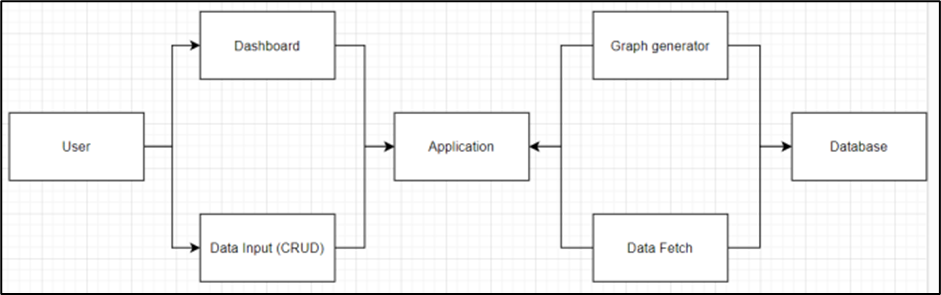
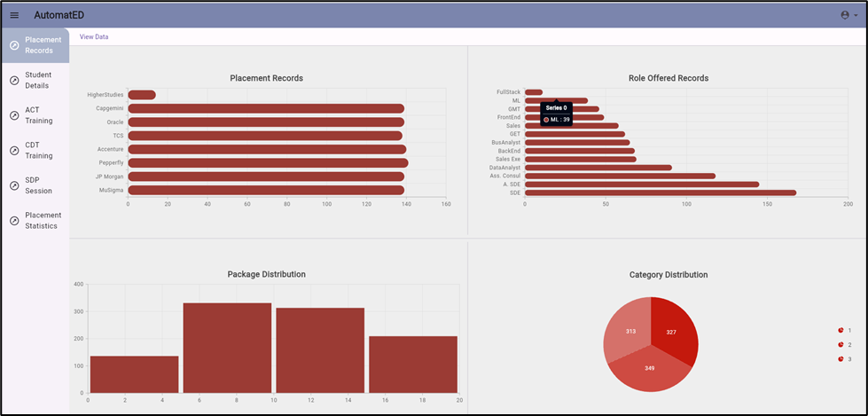
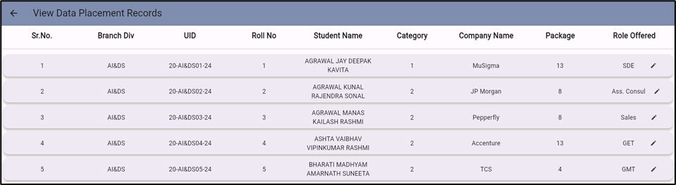
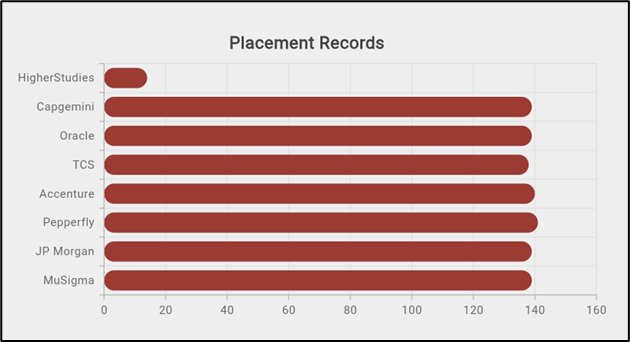
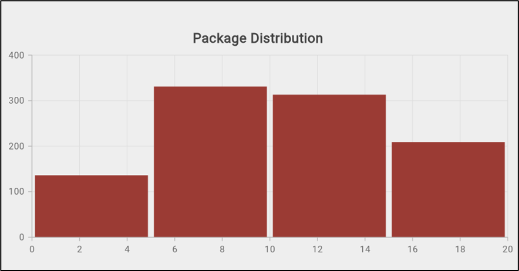

📌 AutomatED — Automating Department Processes

A Training & Placement Cell Automation System

AutomatED is a Flutter-based web application developed as part of our B.Tech Final Year Project to automate and streamline the core operations of a college Training and Placement Cell (TPC).

The system digitizes routine administrative workflows, enables structured data management, and provides actionable insights through interactive analytics.

🎯 Problem Statement

Training and Placement Cells often rely on manual data handling, spreadsheets, and fragmented tools, leading to:

Redundant data entry

Difficulty in tracking student records

Limited visibility into placement statistics

Time-consuming reporting and analysis

💡 Solution Overview

AutomatED provides an end-to-end web-based solution that centralizes student and placement data while enabling efficient management and analysis.

Key objectives:

Reduce manual effort in TPC operations

Improve data consistency and accessibility

Enable quick insights for decision-making

⚙️ Core Features
🔹 Data Management

Full CRUD operations for student, training, and placement records

Structured storage of academic and placement-related data

🔹 Filtering & Querying

Dynamic filtering based on multiple data attributes (tuple identifiers)

Flexible column-wise data exploration

🔹 Analytics & Visualization

Interactive graphical analysis of placement trends

Visual insights into student participation, outcomes, and statistics

🔹 Web-Based Interface

Built using Flutter Web for a responsive and user-friendly experience

🛠️ Tech Stack

Frontend: Flutter (Web)

Backend / Database: MongoDB

Data Processing: Server-side logic for aggregation and filtering

🚀 Impact

Streamlined Training & Placement workflows

Reduced administrative overhead

Faster access to meaningful placement insights

Scalable design adaptable to other academic departments

👥 Contributors

Vinit Sharma — System design, development, analytics modules
👉 https://github.com/sVinit108

Vikrant Singh — Development and integration
👉 https://github.com/VIKRANT17565

📄 Project Context

This project was developed as part of the Bachelor of Engineering (Computer Engineering) Final Year Project, focusing on applying software engineering principles to solve a real institutional problem.

🏗️ System Architecture

The overall system architecture follows a modular design where user interactions are routed through a centralized application layer that handles data management and analytics.

High-level workflow:

Users interact with dashboards or data-entry modules

The application layer manages CRUD operations and requests

Data is fetched from the database and processed for analytics

Graphs and visual insights are generated dynamically

  

📐 Application Design (UML Overview)

The system is structured using object-oriented principles with clear separation between:

Authentication and administration

Application navigation

Training and placement modules

Utility services for data fetching and graph generation

  

📊 Dashboard & Analytics

AutomatED provides interactive dashboards to visualize placement and training data, enabling quick insights for administrators.

Key visualizations include:

Placement distribution across companies

Role-wise hiring trends

Package distribution analysis

Category-wise student distribution

  

📋 Data Management Interface

Administrators can view, filter, and manage detailed placement records through a structured tabular interface.

  

📈 Sample Analytics Outputs

   

